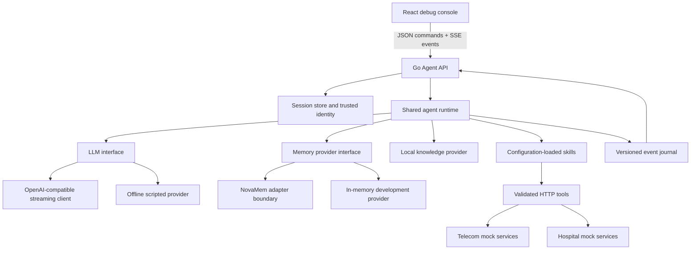

# Architecture

## Shared runtime

`internal/agent` accepts a context, session, turn ID, and text/confirmation command. It does not depend on HTTP, SSE, React, or audio. It selects capabilities, retrieves scoped memories, loads local knowledge, calls an injected model client, validates tool arguments, dispatches HTTP tool requests, and loops with a configured limit. Multiple calls from one model response are supported and executed sequentially so writes and dependencies have a predictable order.

Skill summaries are initially available. Keyword matches activate a subset of skills; the model can activate any configured capability using `skills__activate`. Only active tool schemas are offered. Tool schemas are separate from the persona prompt. Every business tool calls the mock backend, including lookup and demo authentication.

Tool arguments are closed JSON objects of typed strings, with required fields, enum checks, and size limits. Domain IDs/dates and state constraints receive additional backend validation. All tools return the same typed `Result` / `Record` projection with structured errors. An enterprise adapter can project a real backend into that contract or implement the `Executor` interface.

Mutations yield a saved exact-action proposal with a random ID and a five-minute expiry. Only a separate operator confirmation executes it. Arguments and trusted user ID are server-held. A confirmation cannot be replayed. A new ordinary message invalidates outstanding proposals. The backend rechecks ownership and availability at execution time. Tool timeouts are never automatically retried; a timeout on a remote mutation can have an uncertain outcome and should be reconciled by reading current backend state.

## Configuration and new industries

`agents/*/agent.yaml` defines tenant, organization, persona, industry, memory namespace, enabled skills, knowledge paths, branding, future transport settings, and safety rules. `prompt.md` supplies business instructions. `skills.yaml` defines capabilities and their tools. `demo.json` contains optional scripted offline scenarios; a real model does not use it. `memory-seeds.json` is optional fixture history.

To add an agent using existing backend capabilities:

1. Copy an agent directory and assign a unique ID and memory namespace.
2. Set its persona, organization, enabled skills, knowledge, safety, and branding.
3. Set `backend.url` or its `backend.url_env` environment variable and provide compatible user/tool endpoints. Supplied agents use `TELECOM_BACKEND_URL` and `HOSPITAL_BACKEND_URL`, falling back to the shared mock service.
4. Add offline scripts only if the offline provider will be used.
5. Restart to discover the new configuration. No runtime or frontend changes are needed to select it.

For a genuinely new business operation, implement it in a backend adapter and add its schema to a skill file. The runtime remains unchanged. Startup validates duplicate tools, skill references, closed object schemas, and required agent identifiers.

## Sessions and memory

Session histories contain recent conversation/tool protocol messages and are limited to 12 user turns, preserving assistant/tool message pairing. Only one turn runs per session; concurrent sends get HTTP 409. Other sessions run concurrently. Turns have a two-minute deadline. The Stop control cancels the model and HTTP tools via contexts. Sessions are ephemeral and capped at 1,000; expired idle sessions are reaped when creating new sessions.

Long-term service facts live behind the memory interface and are retrieved separately. KW retrieval uses the official NovaMem Go client with scoped accounts and keyword/vector search, returning at most five relevant facts. The local fallback ranks token overlap and remains process-local. Extraction uses per-agent allowlisted regular expressions in `memory.rules` and successful tool `memory_effect` declarations. It is deliberately conservative: service preferences and recurring service issues, not complete transcripts or medical facts. A bounded worker queues writes outside response generation. Queue saturation and failures are visible in events. Shutdown waits for active turns, then drains accepted memory writes.

All memory keys include **tenant + organization + agent/domain + namespace + user**. None of these values comes from model arguments. Tests change each dimension independently to demonstrate isolation, including identical user IDs in separate domains.

## Safety and mock state

Hospital emergency rules run before retrieval, extraction, or model calls. Matching sessions remain in the urgent-assistance path until a new session is started, preventing follow-up booking from bypassing the signal. Conservative keywords can cause false positives and cannot cover every emergency phrasing. Clinical request patterns produce an administrative-only response; model prompts reinforce the boundary.

Mock state is protected by a mutex. Appointment booking checks the slot and patient conflicts in one critical section. Rescheduling releases the previous slot only after validating the new one. Cancelling releases the slot. An unavailable doctor has no slots during the first week, but does in the second. All dates use UTC and are generated relative to server startup.

Telecom outages, restrictions, and physical line faults block equipment mutations. Restart repairs unhealthy routers. Wi-Fi optimization changes the channel and diagnostics. Itemized invoices expose roaming and installation charges. Plan recommendations are grounded in the catalog.

## Observability and future transports

Events have a version, monotonic session sequence, session ID, turn ID, timestamp, type, and structured data. The journal retains 1,000 events per session for SSE reconnect replay. JSON logs include event type and session/turn identifiers; full conversations and credentials are not logged. Debug event payloads intentionally contain fictional records and retrieved memory.

A future WebSocket/WebRTC adapter can translate final recognized text into the same `Turn`, consume the same event sink for model text, and call session cancellation for barge-in. Speech/audio and avatar events can share the envelope without entering the agent loop. Voice/avatar settings are disabled declarations only; Phase 1 contains no placeholder engine or media dependency. Production authentication, durable journals, inference capacity management, tenant provisioning, and interface-specific consent belong in later adapters/services.
